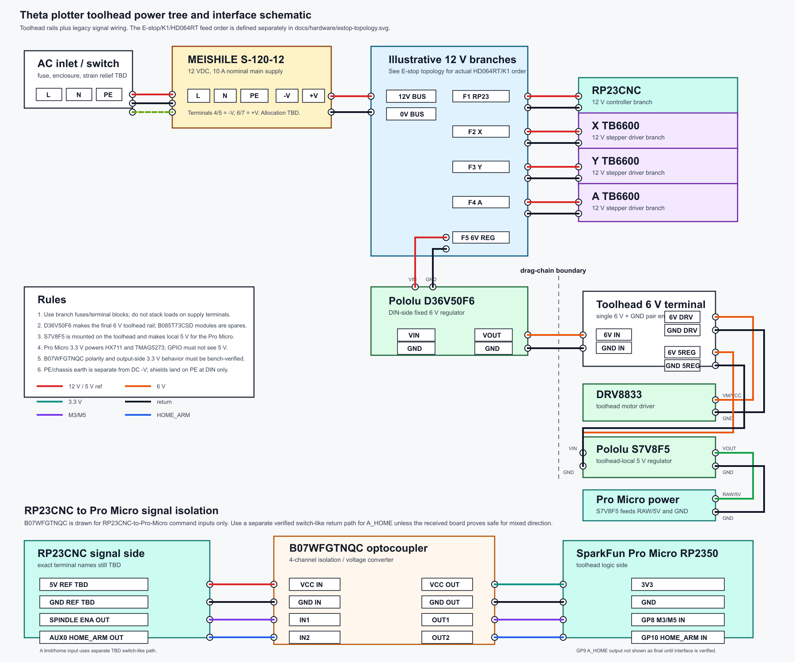

# Power Distribution

This is the current power-distribution and command-interface plan for the
plotter. The authoritative connection records remain in
[`WIRING_TABLE.md`](WIRING_TABLE.md); if this document disagrees with the wiring
table, the wiring table controls.

Do not energize any branch until the listed verification gates pass.

## Current Architecture

```text
AC mains
  -> protected inlet / switch / fuse / enclosure / strain relief TBD
  -> MEISHILE S-120-12 12 VDC supply
     -> FMAIN (DC main fuse, maximum 10 A; final type/TBD)
        -> protected 12 V bus
        |  -> FCTRL -> always-on control branch (value TBD)
        |     -> RP23CNC controller and its isolated-control-input supply
        |
        -> HD064RT eight-channel fused distribution module
              -> OUT1 X TB6600 driver
              -> OUT2 Y TB6600 driver
              -> OUT3 A TB6600 driver
              -> OUT4 Pololu D36V50F6 fixed 6 V regulator
           -> 6 V toolhead rail through drag chain
              -> DRV8833 motor supply
              -> Pololu S7V8F5 local 5 V regulator on toolhead
                 -> SparkFun Pro Micro RP2350 5 V input
                    -> RP2350 3.3 V rail
                       -> HX711
                       -> TMAG5273 Qwiic
```

## Viewable Schematic

The broad toolhead power-tree and command-interface schematic is:



[Open the power-distribution schematic PNG](../../power-distribution-schematic.png)

Editable source:
[`../../power-distribution-schematic.svg`](../../power-distribution-schematic.svg)

## Main Supply

The main supply is the received MEISHILE `S-120-12`.

| Terminal | Function | Current status |
|---|---|---|
| `L` | AC line/live | documented; enclosure/protection TBD |
| `N` | AC neutral | documented; enclosure/protection TBD |
| Protective-earth symbol | PE/chassis earth | documented; continuity test required |
| `-V`, `-V` | 12 VDC negative | documented; final terminal allocation TBD |
| `+V`, `+V` | 12 VDC positive | documented; final terminal allocation TBD |
| `+V ADJ` | voltage adjustment | measure before connecting loads |

The two `+V` and two `-V` terminals are not enough to directly land every final
branch cleanly. The received HCDC `HD064RT` is the fused DIN distribution module
for the motor/tool branches. Its eight outputs are not a substitute for
the separately fused, always-on controller/control branch.

## Emergency-stop topology

The purchased mxuteuk `HB2-BS544` is a latching, twist-release, 22 mm mushroom
switch with two electrically independent normally-closed contacts. The initial
machine wiring uses only one pair:

```text
SW1 NC-A -> RP23CNC opto-isolated E-stop/Halt input
SW1 NC-B -> unused, terminals individually insulated
```

Pressing SW1 makes RP23CNC halt. It does not remove the 12 V supply from the
TB6600 drivers or the D36V50F6/toolhead actuator branch. RP23CNC stays powered
from `FCTRL`; release of SW1 restores the *ability* to re-arm motion but does
not authorize it. The grblHAL E-stop/Halt state must be reset and unlocked
deliberately.

This is a controller-Halt arrangement, not a means to isolate motor energy and
not a claim of certified functional-safety performance. Use the existing main
power switch to deliberately de-energize the machine. Do not wire SW1 until
E-19 passes.
See [`ESTOP_TOPOLOGY.md`](ESTOP_TOPOLOGY.md) for the net-level plan and test
requirements.

## 12 V Branches

Planned 12 V branches from the MEISHILE supply:

| Branch | Load | Notes |
|---|---|---|
| 12V-RP23CNC | RP23CNC controller and control-input supply | Always on through `FCTRL`; final fuse value and terminals TBD |
| 12V-X | X TB6600 driver | HD064RT `OUT1`; protected by its branch fuse; driver input labels and current setting must be verified |
| 12V-Y | Y TB6600 driver | HD064RT `OUT2`; protected by its branch fuse; driver input labels and current setting must be verified |
| 12V-A | A TB6600 driver | HD064RT `OUT3`; protected by its branch fuse; driver input labels and current setting must be verified |
| 12V-TOOL-6V | Pololu D36V50F6 `VIN/GND` | HD064RT `OUT4`; protected by its branch fuse; generates the 6 V toolhead rail |

The HD064RT's factory 3 A fuses are only initial fitted parts, not approved
values for this machine. Each output's final fuse value is TBD until the
measured current budget is complete. The module is specified for 20 A total and
its positions accept up to 10 A after a suitable fuse is fitted; the 10 A main
supply remains the limiting source.

## Wiring Table Cross-Reference

These are the power rows that currently define the buck/regulator path:

| Wiring IDs | Path | Status |
|---|---|---|
| `PWR-009A`, `PWR-009B` | MEISHILE 12 V distribution to Pololu D36V50F6 `VIN/GND` | TBD terminal allocation |
| `PWR-009`, `PWR-010` | D36V50F6 `VOUT/GND` to DRV8833 motor supply | selected; bench verification required |
| `PWR-011A`, `PWR-011B` | D36V50F6 `VOUT/GND` to toolhead S7V8F5 `VIN/GND` | selected; local split on toolhead |
| `PWR-011`, `PWR-012` | S7V8F5 `VOUT/GND` to SparkFun Pro Micro RP2350 `RAW/5V` and `GND` | purchased; output verification required |
| `PWR-013` through `PWR-015` | Pro Micro 3.3 V/Qwiic rail to HX711 and TMAG5273 | pending sensor bench tests |

## Toolhead Power

The final planned toolhead power path uses two regulators:

| Regulator | Location | Input | Output | Purpose |
|---|---|---|---|---|
| Pololu D36V50F6, item 4092 | DIN/control side | 12 V from main distribution | fixed 6 V | toolhead motor rail |
| Pololu S7V8F5, item 2123 | toolhead | 6 V toolhead rail | fixed 5 V | Pro Micro logic input |

Only the 6 V toolhead power pair runs through the drag chain for this branch:

```text
D36V50F6 VOUT -> 6V_TO_TOOLHEAD
D36V50F6 GND  -> GND_TO_TOOLHEAD
```

On the toolhead, split the 6 V locally:

```text
6V_TO_TOOLHEAD -> DRV8833 motor supply
6V_TO_TOOLHEAD -> S7V8F5 VIN
GND_TO_TOOLHEAD -> DRV8833 GND
GND_TO_TOOLHEAD -> S7V8F5 GND
```

Then:

```text
S7V8F5 VOUT -> SparkFun Pro Micro RP2350 RAW/5V input
S7V8F5 GND  -> Pro Micro GND
Pro Micro 3V3 -> HX711 VCC and TMAG5273 Qwiic 3V3
Pro Micro GND -> HX711 GND and TMAG5273 Qwiic GND
```

Do not feed 6 V directly into the Pro Micro `3V3` rail or any RP2350 GPIO.

## B07WFGTNQC Signal Isolation

The B07WFGTNQC 4-channel optocoupler module is added to the schematic as the
planned RP23CNC-to-Pro-Micro command-input interface. It is not a power
distribution part.

| Channel | Input side | Output side | Purpose | Status |
|---|---|---|---|---|
| `CH1` | RP23CNC spindle `ENA` / M3-M5 output TBD | Pro Micro `GP29` / A3 | ENGAGE/LIFT command | PC817C U1; repeat bench test after direct-header harness repin |
| `CH2` | RP23CNC `Aux 0` / `HOME_ARM` output TBD | Pro Micro `GP28` / A2 | Allow A-home assertion only during homing | PC817C U2; repeat bench test after direct-header harness repin |
| `CH3`, `CH4` | Unused | Unused | Spare channels | do not wire yet |

The Pro Micro-to-RP23CNC `A_HOME` signal goes the opposite direction from
`CH1` and `CH2`. Do not run `A_HOME` through the same fixed-direction module
unless the received board is inspected and bench-tested in a way that proves
mixed-direction wiring does not defeat isolation or expose RP2350 GPIO to an
unsafe voltage.

## Grounds And Earth

Keep these concepts distinct:

| Name | Meaning | Notes |
|---|---|---|
| PE / chassis earth | safety earth from AC inlet and MEISHILE earth terminal | bond supply chassis, enclosure, DIN rail PE, and cable shields here |
| 12 V `-V` | DC return for 12 V loads | not the same thing as PE for shield termination |
| toolhead GND | 6 V/5 V/3.3 V local return | common reference for DRV8833, S7V8F5, Pro Micro, HX711, and TMAG5273 |
| signal ground/reference | logic return for level shifting where required | do not use as shield drain |

Shield/drain wires from the stepper motor cables land on PE/chassis at the
driver/DIN end only. They do not land on `-V`, TB6600 `DC-`, RP23CNC signal
ground, or toolhead ground.

## Open Verification Gates

| Gate | Required evidence |
|---|---|
| E-11 | MEISHILE terminal labels, output voltage, adjustment range, and PE continuity |
| E-14 | D36V50F6 input/output polarity and 6.0 V output |
| E-15 | D36V50F6 ripple, temperature, and current margin under actuator load |
| E-15A | S7V8F5 5.0 V output stability with RP2350/sensors active and actuator moving |
| interface module | B07WFGTNQC silkscreen, channel direction, polarity, input current, and output-side 3.3 V compatibility |
| power budget | measured total current and branch fuse sizing |
| E-19 | SW1 NC-A continuity, RP23CNC Halt/reset behavior, and no automatic motion restart |
| wiring inspection | final conductor gauge, ferrules, strain relief, and terminal allocation |

## Do Not Connect Yet

- AC mains without enclosure, fuse, switch, and strain relief.
- Any TBD terminal allocation as if it were final.
- The DRV8833 or N20 motor before the 6 V regulator is meter-verified.
- The Pro Micro before the S7V8F5 output is meter-verified at 5.0 V.
- Cable shields to DC `-V` or signal ground.
- The E-stop/relay circuit until its terminals, diode polarity, fuse values, and
  E-19 behavior are verified.
